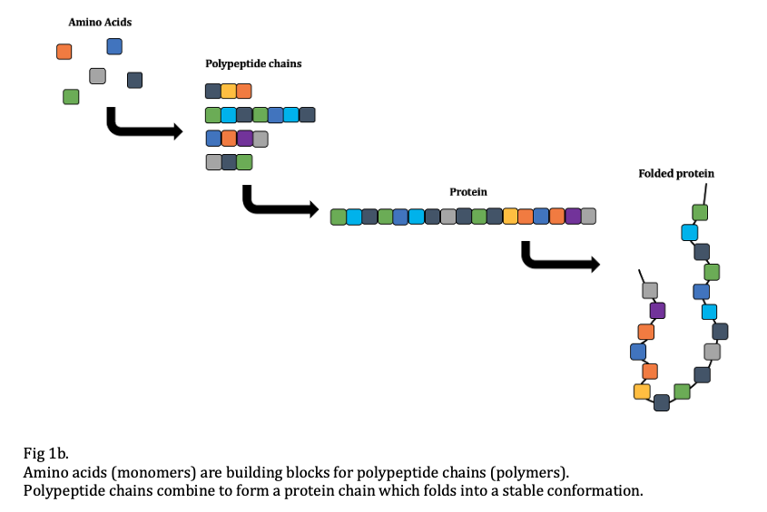

# Protein Sequence Variability Prediction
This project investigates the protein sequence variability prediction using machine learning methods.

# Motivation 
Proteins are complexes of varying size, structure and function that enables essentially all biological processes in every organism.
They are linear polymers of a combination of monomer units called amino acids. The sequence of amino acids in turn, folds and adopts into a 3-D structure of the overall protein through various chemical interactions and bonds between them. The remarkable protein functions are efficiently dictated by sequences of amino acids.

During the protein folding process it is crucial the right structure is maintained in the organism, as misfolding of proteins could result in having wrong dynamics and in turn changing the protein function which can lead to diseases or have impact on the health of the cell.

One of the challenges currently faced in protein modelling is the enormous search space, which results in a computationally NP-hard problem [Pierce and Winfree, 2002].

Therefore, understanding the interaction between amino acid sequences with their corresponding three-dimensional structure and in turn, determining protein functions would be a significant breakthrough for researchers as it would offer endless possibilities for customised proteins. This revolution would be able to address several important challenges that society faces in the fields of biomedicine, for example in-silico rational drug design.

## Aim
This research project focuses on addressing some of the challenges currently faced in the field of protein design one of which is the enourmous search space.
## Objective
Try to learn and predict the **variability** of the positions in an amino acid sequence where structural changes can be made to alter the protein function, while preserving also the correct folding without causing diseases within the organism, given the data on the **protein dynamics** and the data on the **composition of a protein in different organisms** using machine learning methods. \
The variability for a position significes, how many different amino acids are possible to accommodate on the position. This would in turn reduce the search space.

# Methods 

## Data Collection Process
The data collection and some preparation process for the analysis has been done in collaboration with members of the Computational Biology lab of Brunel University London. 
The main source of data used to gain knowledge involving protein structure is the “Protein Data Bank”. The protein on which the study was conducted on is **lysozyme**, given the broad knowledge available on its functions and dymanics, thus, providing a solid base for examples to be provided to the machine learning methods.

#### - Multiple Sequence Alignment (data on the coposition of protein)
Protein homogeneity between organisms can be studied with Multiple Sequence Alignment tools to find evolutionary relationships between genes. This method is often utilised to identify sequence areas which are preserved throughout groups of sequences hypothesised to be evolutionary. 
 
The multiple sequence alignment data was generated by the lab team using a specific software named HHBlits, which essentially uses hidden Markov models (HMMs) to search protein sequences and provides very fast results by HMM-HMM alignment. 
#### - Molecular Dynamic Simulation (data on the proteins movements) 
Molecular simulation methods are utilised to simulate and analyse physical movements of atoms and molecules. Simulating proteins using all-atom molecular dynamic method affects its applicability as is results very costly thus, dynamical properties of the protein can be obtained simulating the simplified version of the protein, Coarse-grained models.

The lab team has run molecular-dynamic simulations software GROMACS using a coarse-grained force field called SIRAH. As a result, the **Root-mean square fluctuation (RMSF)** was calculated from the coordinates of the simulation, which essentially provides compressed information of the protein dynamics. The **RMSF** measures the deviation of the coarse-grained model position with respect to a reference coordinates over time.

#### - Data Preparation 

As mentioned above, the information on the composition of this protein in different organisms, was obtained performing MSA using HHblits.This resulted into a matrix of 164 columns and 1112 rows. Thus 1112 sequences from various organisms with various combinations of the 20 amino acids were aligned. \
From this matrix, valuable information could be gained that was required for the rest of the analysis. \
By calculating the **relative frequency** of each position on the amino acid sequence, we gained information on the number of times a specific amino acid was present compared to the total number of occurrences. \
From this the **Shannon’s entropy** could be calculated as a measure of **variability**, which represents what we would like to predict using the Machine Learning models, the output. 

### Machine Learning Methods

Machine Learning (ML) methods given their capabilities to identify hidden patterns in the provided data by learning over time in an self-directed manner are suitable for predicting positions in an amino acid sequence where structural changes can be made. Amongst the two main types of Machine Learning, supervised leaning is of interest for the purpose of this study as the aim is to try building a model which is able capture the relationship between **frequencies of residue occurrence** provided by the data on the composition of a protein from different organisms (MSA), coupled with the **protein dynamics (RMSF)** and the given example of what the **output (Shannon's entropy)** should look like. \

The ML methods explored here were: 
- Linear Regression
- Decision Trees
- Random Forests
- Deep Neural Networks

