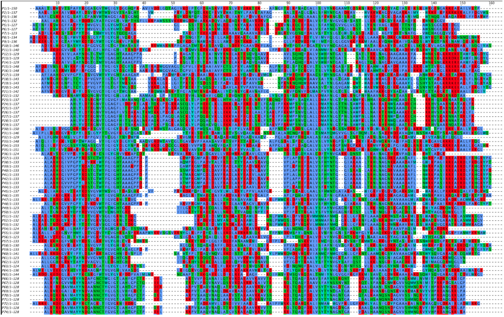
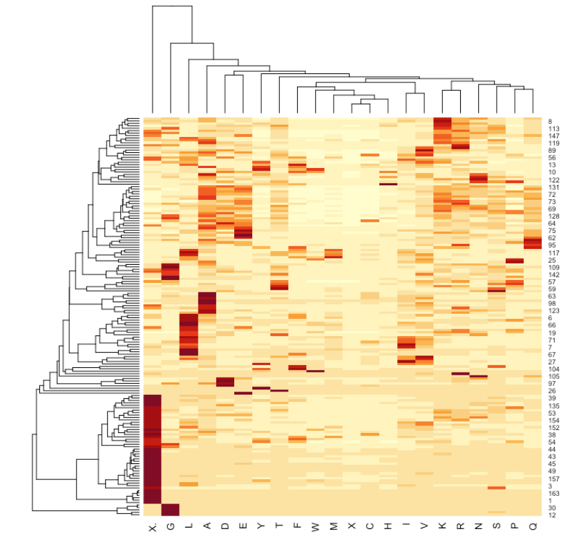

# Protein Sequence Variability Prediction
This project investigates the protein sequence variability prediction using machine learning methods.

# Motivation 
Proteins are complexes of varying size, structure and function that enables essentially all biological processes in every organism.
They are linear polymers of a combination of monomer units called amino acids. The sequence of amino acids in turn, folds and adopts into a 3-D structure of the overall protein through various chemical interactions and bonds between them. The remarkable protein functions are efficiently dictated by sequences of amino acids.

During the protein folding process it is crucial the right structure is maintained in the organism, as misfolding of proteins could result in having wrong dynamics and in turn changing the protein function which can lead to diseases or have impact on the health of the cell.

One of the challenges currently faced in protein modelling is the enormous search space, which results in a computationally NP-hard problem [Pierce and Winfree, 2002].

Therefore, understanding the interaction between amino acid sequences with their corresponding three-dimensional structure and in turn, determining protein functions would be a significant breakthrough for researchers as it would offer endless possibilities for customised proteins. This revolution would be able to address several important challenges that society faces in the fields of biomedicine, for example in-silico rational drug design.

## Aim
This research project focuses on addressing some of the challenges currently faced in the field of protein design one of which is the enourmous search space.
## Objective
Try to learn and predict the **variability** of the positions in an amino acid sequence where structural changes can be made to alter the protein function, while preserving also the correct folding without causing diseases within the organism, given the data on the **protein dynamics** and the data on the **composition of a protein in different organisms** using machine learning methods. \
The variability for a position significes, how many different amino acids are possible to accommodate on the position. This would in turn reduce the search space.

# Methods 

## Data Collection Process
The data collection and some preparation process for the analysis has been done in collaboration with members of the Computational Biology lab of Brunel University London. 
The main source of data used to gain knowledge involving protein structure is the “Protein Data Bank”. The protein on which the study was conducted on is **lysozyme**, given the broad knowledge available on its functions and dymanics, thus, providing a solid base for examples to be provided to the machine learning methods.

#### - Multiple Sequence Alignment (data on the coposition of protein)
Protein homogeneity between organisms can be studied with Multiple Sequence Alignment tools to find evolutionary relationships between genes. This method is often utilised to identify sequence areas which are preserved throughout groups of sequences hypothesised to be evolutionary. 
 
The multiple sequence alignment data was generated by the lab team using a specific software named HHBlits, which essentially uses hidden Markov models (HMMs) to search protein sequences and provides very fast results by HMM-HMM alignment. 
#### - Molecular Dynamic Simulation (data on the proteins movements) 
Molecular simulation methods are utilised to simulate and analyse physical movements of atoms and molecules. Simulating proteins using all-atom molecular dynamic method affects its applicability as is results very costly thus, dynamical properties of the protein can be obtained simulating the simplified version of the protein, Coarse-grained models.

The lab team has run molecular-dynamic simulations software GROMACS using a coarse-grained force field called SIRAH. As a result, the **Root-mean square fluctuation (RMSF)** was calculated from the coordinates of the simulation, which essentially provides compressed information of the protein dynamics. The **RMSF** measures the deviation of the coarse-grained model position with respect to a reference coordinates over time.

## Data Preparation 

As mentioned above, the information on the composition of this protein in different organisms, was obtained performing MSA using HHblits.This resulted into a matrix of 164 columns and 1112 rows. Thus 1112 sequences from various organisms with various combinations of the 20 amino acids were aligned. \
From this matrix, valuable information could be gained that was required for the rest of the analysis. \

By calculating the **relative frequency** of each position on the amino acid sequence, we gained information on the number of times a specific amino acid was present compared to the total number of occurrences. \
From this the **Shannon’s entropy** could be calculated as a measure of **variability**, which represents what we would like to predict using the Machine Learning models, the output. 

## Machine Learning Methods

Machine Learning (ML) methods given their capabilities to identify hidden patterns in the provided data by learning over time in an self-directed manner are suitable for predicting positions in an amino acid sequence where structural changes can be made. Amongst the two main types of Machine Learning, supervised leaning is of interest for the purpose of this study as the aim is to try building a model which is able capture the relationship between **frequencies of residue occurrence** provided by the data on the composition of a protein from different organisms (MSA), coupled with the **protein dynamics (RMSF)** and the given example of what the **output (Shannon's entropy)** should look like. 

The ML methods explored here were: 
- Linear Regression
- Decision Trees
- Random Forests
- Deep Neural Networks

## Model Evaluation Techniques - Training and Testing

It is fundamentally essential to utilise robust techniques to train and evaluate model’s performance on the training data available at hand, as the more reliable the estimate of a model, the more one can push the model and be self-assured of it will interpret to the operational utilisation of the model. Evaluation techniques used: 
- Holdout method
- k-fold cross-validation

## Performance Evaluation Metrics
-  The Mean Squared Error (MSE)
-  The Root Mean Squared Error(RMSE)
-  Mean Absolute Error (MAE)
 

# Data Analysis and Results 

## Exploratory Data Analysis

**Multiple Sequence Alignment data**

Prior to formal modelling of the data, some exploratory data analysis was carried out to maximise the insight on the data-set. This included exploration of the Multiple Sequence Alignment data which assessed the assumptions of amino acid information gained from the literature review. 

Amino acids can be loosely classified as **hydrophobic, polar, charged and amphipathic** based on the chemical characteristics in the side chains. The amino acids from the multiple sequence alignment data is visualised below according to the colours as specified in the legend. It is very useful to analyse the multiple sequence alignment as functional and structural information can be obtained from analysing the conservation pattern within an alignment. \

Generally, **charged and polar** residues for the lysozyme protein tend to be on the surface, and are less preserved overall, while **hydrophobic** residues tend to be in the core, resulting in greater preservation. This presumption can be confirmed, by the visualisation below of protein structure according to the colour scheme of the amino acids based on their categories as specified on table above. **The surface result being emphasised by more polar and charged residues and the core by more hydrophobic residues.**

 

**Heatmap**

The heatmap generates a representation of the relative frequencies of occurrence of the of the different amino acids. Thus, it is possible to observe for which position in the lysozyme amino acid sequence a certain residue prevails. The heatmap generated by R, automatically clustered the amino acids as well as the positions at the same time. Indeed, clustering was done by reordering them according to the cluster structure of the dendrogram. While inspecting this, it is possible to see presence of patterns. For example, observing the amino acids dendrogram, their grouping seem to somewhat resemble the groupings according to the four classes discussed earlier (charged, polar, hydrophobic, amphipathic). However, the class groups are not entirely the same; reason being, the clusters of the dendrogram generated by the graphic is dependant only on the frequency
of occurrence of each position from the given dataset. Furthermore, clusters were created according to the amino acid which has a similar frequency pattern. 

For instance, when observing the gaps (‘ X. ‘), it is separated from all the others because their patterns do not resemble any other amino acid, rightly. While looking at the residues G, L, A it is possible to see the presence of a strange pattern; G is in a way, separated from the others. Then, L is similar to the group which also contains A. Furthermore, K and R, are in a cluster together; similarly V and I are also in a cluster together; this is because in terms of their chemical properties, they end up as having similar soles thus ending up in similar positions, which is why they tend to be affected in similar variability. 

Investigating the positions, it would probably map with part of the proteins which tends to have similar variability patterns across the amino acids. Reason being, the positions are clustered against the amino acids; if a position can generally accommodate more frequently hydrophobic residues, it would have a similar pattern to another position that can accommodate another hydrophobic residue. Due to time restrictions, it is not possible to demonstrate the pattern obtained from the clusters on the structures, which would visualise the explanation above.

**Plot of entropy per position**

As mentioned earlier, Shannon entropy provides a measure of variability. The graph above represents the plot of entropy value for each position from the multiple sequence alignment data. Hence, here for a given residue position from the alignment data, it is possible to observe the amount of variability of that position, more specifically, indicating the mutational flexibility. Locations with a higher value of entropy, indicate the most variable position, implying the possibility to accommodate a wider range of amino acids on that location. Vice versa, lower value of entropy implies a lower variability. From the line chart above, it is possible to see the presence of the least variable position, peaking negatively at around position where the entropy is very low.

**Plot of RMSF per position**

As previously mentioned, the Root means square fluctuation (RMSF) provides compressed information of the protein dynamics. As expected, from the graph above it can be observed the presence of positions, which are more dynamic than others. The flexibility or rigidity of a particular region can be perceived observing the values of the RMSF, where the more dynamic parts are specified by a high RMSF and the more static parts by the low RMSF. Observing the graph, this feature peaks towards the end of the sequence. Other prominent peaks are present approximately between position 37 and 60.

**Plot of entropy with RMSF, per position**

Combining the two concepts mentioned above, the variability and flexibility one can learn a lot about a protein. Thus, it is worthwhile plotting the values of RMSF and Shannon entropy on the same plot for each position of the protein sequence alignment data. The values were both standardised to be comparable. Inspecting the graph, it is possible to observe the lines diverging from one another on the ends; there are regions where they match roughly but others where they diverge. More on this is discussed under performance evaluation.

## Performance Evaluation

## Results

