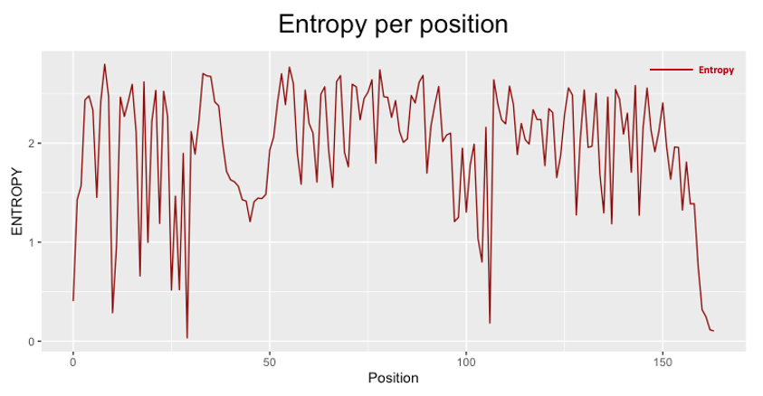
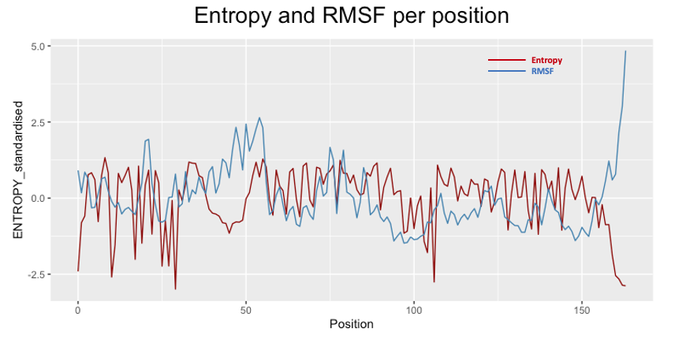
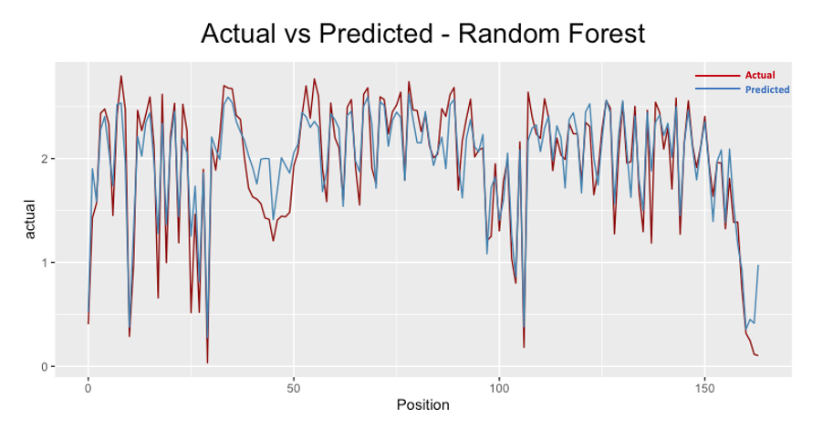
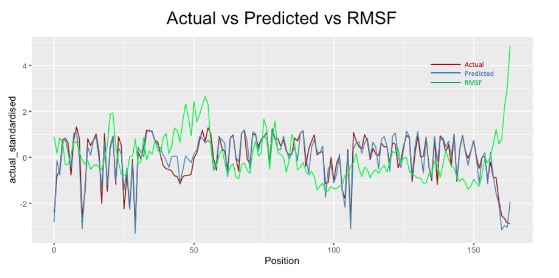

<h1> Table of Contents </h1>

<li><a href="#Protein_Sequence_Variability_Prediction">1. Protein Sequence Variability Prediction</a></li>
<ul>
  <li><a href="#Overview">1.1 Overview </a></li>
</ul> 
<li><a href="#Motivation">2. Motivation</a></li>
<li><a href="#Aim">3. Aim</a></li>
<li><a href="#Objectives">4. Objectives</a></li>
<li><a href="#Methods">5. Methods</a></li>
<ul> 
 <li><a href="#Data_Collection_Process">5.1 Data Collection Process</a></li>
 <li><a href="#Data_Preparation">5.2 Data Preparation </a></li>
 <li><a href="#Machine_Learning_Methods">5.3 Machine Learning Methods </a></li>
 <li><a href="#Model_Evaluation_Teachniques">5.4 Model Evaluation Techniques - Training and Testing </a></li>
 <li><a href="#Performance_Evaluation_Metrics">5.5 Performance Evaluation Metrics </a></li> 
</ul> 
<li><a href="#Data_Analysis_and_Results">6. Data Analysis and Results</a></li>
<ul>
 <li><a href="#Exploratory_Data_Analysis">6.1 Exploratory Data Analysis</a></li>
 <li><a href="#Performance_Evaluation">6.2 Performance Evaluation</a></li>
 <li><a href="#Results">6.3 Results and Discussion</a></li>
</ul> 
<li><a href="#Limitations">7. Limitations and future work </a></li>

<h1 id="Protein_Sequence_Variability_Prediction">1. Protein Sequence Variability Prediction</h1>

This project investigates the protein sequence variability prediction using machine learning methods.

<h2 id="Overview"> Overview </h2>

The study was motivated to address one of the challenges faced currently in protein structure prediction from its sequence: the enormous  search space. This research aimed at developing a sophisticated machine learning method to predict sequence variability from the information on the composition of the protein called Lysozyme in various organisms coupled with the dynamics. Reason being, the search space would be reduced significantly. 

More specifically, multiple sequence alignment data of Lysozyme carry the evolutionary information of different organisms; from this a measure of **variability** per position could be calculated. On the other hand the information on the protein dynamics were provided by the computational lab, in a compressed form, representing a measure of **flexibility**. Eventually, the relative frequencies of amino acids , the measure of flexibility and the entropy were grouped to form the final dataset to conduct the study.

Exploratory data analysis was carried out on the multiple sequence alignment, relative frequency matrix, dynamical and variability measures to gain insights on the data prior to performing predictive methods.

To predict the variability per position, various machine learning methods were used to learn the complex relationship between the features and the output. Methods include linear regression, decision trees, random forest and neural networks. The best method to perform the prediction was identified based on performance metrics.

The best and worst method were compared, evaluated and discussed thoroughly within the same framework, from which insightful findings were obtained.

In conclusion, the study identified the best method to predict the variability. Moreover, it identified the regions which are the easier to predict and which are not.

<h1 id="Motivation">2. Motivation </h1>
Proteins are complexes of varying size, structure and function that enables essentially all biological processes in every organism.

They are linear polymers of a combination of monomer units called amino acids. 

The sequence of amino acids in turn, folds and adopts into a 3-D structure of the overall protein through various chemical interactions and bonds between them. The remarkable protein functions are efficiently dictated by sequences of amino acids.

 

 

During the protein folding process it is crucial the right structure is maintained in the organism, as misfolding of proteins could result in having wrong dynamics and in turn changing the protein function which can lead to diseases or have impact on the health of the cell.

One of the challenges currently faced in protein modelling is the enormous search space, which results in a computationally NP-hard problem [Pierce and Winfree, 2002].

Understanding the interaction between amino acid sequences with their corresponding three-dimensional structure and in turn, determining protein functions would be a significant breakthrough for researchers as it would offer endless possibilities for customised proteins. This revolution would be able to address several important challenges that society faces in the fields of biomedicine, for example in-silico rational drug design.

<h1 id="Aim"> 3. Aim</h1> 

The primary research aim is to design, implement and test machine learning models to try predicting the most useful position for a mutation for protein design, given  information on the evolutionary history of sequence and the dynamics of the structure. This would focus on addressing one of the challanges faced in the field of protein design, as mentioned earlier, the enourmous search space.

<h1 id="Objectives"> 4. Objectives </h1>

- Gather and analyse the literature review.
- Collect and define a suitable dataset. This requires to be built containing information of amino acid sequences of the same protein present in various living organisms and aligned to identify the variability as a quantitative measure combined with the relevant dynamics of the structure.
- Develop pipeline in Python to test a simple multiple linear regression model to try predicting the most variable positions.
- Develop pipeline in Python to test more sophisticated machine learning models such as **decision trees, random forest and deep neural networks** to try predicting the most variable positions.
- Evaluate the models by using general machine learning evaluation methods such as MSE, RMSE, MAE.
- Discuss on the results

<h1 id="Methods"> 5. Methods </h1>

<h2 id ="Data_Collection_Process"> Data Collection Process</h2>

The data collection and some preparation process for the analysis has been done in collaboration with members of the Computational Biology lab of Brunel University London. 
The main source of data used to gain knowledge involving protein structure is the “Protein Data Bank”. The protein on which the study was conducted on is **lysozyme**, given the broad knowledge available on its functions and dymanics, thus, providing a solid base for examples to be provided to the machine learning methods.

#### - Multiple Sequence Alignment (data on the coposition of protein)
Protein homogeneity between organisms can be studied with Multiple Sequence Alignment tools to find evolutionary relationships between genes. This method is often utilised to identify sequence areas which are preserved throughout groups of sequences hypothesised to be evolutionary. 
 
The multiple sequence alignment data was generated by the lab team using a specific software named HHBlits, which essentially uses hidden Markov models (HMMs) to search protein sequences and provides very fast results by HMM-HMM alignment. 
#### - Molecular Dynamic Simulation (data on the proteins movements) 
Molecular simulation methods are utilised to simulate and analyse physical movements of atoms and molecules. Simulating proteins using all-atom molecular dynamic method affects its applicability as is results very costly thus, dynamical properties of the protein can be obtained simulating the simplified version of the protein, Coarse-grained models.

The lab team has run molecular-dynamic simulations software GROMACS using a coarse-grained force field called SIRAH. As a result, the **Root-mean square fluctuation (RMSF)** was calculated from the coordinates of the simulation, which essentially provides compressed information of the protein dynamics. The **RMSF** measures the deviation of the coarse-grained model position with respect to a reference coordinates over time.

<h2 id="Data_Preparation">Data Preparation </h2>

As mentioned above, the information on the composition of this protein in different organisms, was obtained performing MSA using HHblits.This resulted into a matrix of 164 columns and 1112 rows. Thus 1112 sequences from various organisms with various combinations of the 20 amino acids were aligned. \
From this matrix, valuable information could be gained that was required for the rest of the analysis. \

By calculating the **relative frequency** of each position on the amino acid sequence, we gained information on the number of times a specific amino acid was present compared to the total number of occurrences. \
From this the **Shannon’s entropy** could be calculated as a measure of **variability**, which represents what we would like to predict using the Machine Learning models, the output. 

<h2 id="Machine_Learning_Methods"> Machine Learning Methods </h2>

Machine Learning (ML) methods given their capabilities to identify hidden patterns in the provided data by learning over time in an self-directed manner are suitable for predicting positions in an amino acid sequence where structural changes can be made. Amongst the two main types of Machine Learning, supervised leaning is of interest for the purpose of this study as the aim is to try building a model which is able capture the relationship between **frequencies of residue occurrence** provided by the data on the composition of a protein from different organisms (MSA), coupled with the **protein dynamics (RMSF)** and the given example of what the **output (Shannon's entropy)** should look like. 

The ML methods explored here were: 
- Linear Regression
- Decision Trees
- Random Forests
- Deep Neural Networks

<h2 id="Model_Evaluation_Teachniques"> Model Evaluation Techniques - Training and Testing </h2>

It is fundamentally essential to utilise robust techniques to train and evaluate model’s performance on the training data available at hand, as the more reliable the estimate of a model, the more one can push the model and be self-assured of it will interpret to the operational utilisation of the model. Evaluation techniques used: 
- Holdout method
- k-fold cross-validation

<h2 id="Performance_Evaluation_Metrics"> Performance Evaluation Metrics </h2>
- The Mean Squared Error (MSE)
- The Root Mean Squared Error(RMSE)
- Mean Absolute Error (MAE)
 

<h1 id="Data_Analysis_and_Results"> 6. Data Analysis and Results </h1>

<h2 id="Exploratory_Data_Analysis"> Exploratory Data Analysis </h2>

**Multiple Sequence Alignment data**

Prior to formal modelling of the data, some exploratory data analysis was carried out to maximise the insight on the data-set. This included exploration of the Multiple Sequence Alignment data which assessed the assumptions of amino acid information gained from the literature review. 

Amino acids can be loosely classified as **hydrophobic, polar, charged and amphipathic** based on the chemical characteristics in the side chains. The amino acids from the multiple sequence alignment data is visualised below according to the colours as specified in the legend. It is very useful to analyse the multiple sequence alignment as functional and structural information can be obtained from analysing the conservation pattern within an alignment. \

Generally, **charged and polar** residues for the lysozyme protein tend to be on the surface, and are less preserved overall, while **hydrophobic** residues tend to be in the core, resulting in greater preservation. This presumption can be confirmed, by the visualisation below of protein structure according to the colour scheme of the amino acids based on their categories as specified on table above. **The surface result being emphasised by more polar and charged residues and the core by more hydrophobic residues.**

  

 

**Heatmap**

 

 

The heatmap generates a representation of the relative frequencies of occurrence of the of the different amino acids. Thus, it is possible to observe for which position in the lysozyme amino acid sequence a certain residue prevails. The heatmap generated by R, automatically clustered the amino acids as well as the positions at the same time. Indeed, clustering was done by reordering them according to the cluster structure of the dendrogram. While inspecting this, it is possible to see presence of patterns. For example, observing the amino acids dendrogram, their grouping seem to somewhat resemble the groupings according to the four classes discussed earlier (charged, polar, hydrophobic, amphipathic). However, the class groups are not entirely the same; reason being, the clusters of the dendrogram generated by the graphic is dependant only on the frequency
of occurrence of each position from the given dataset. Furthermore, clusters were created according to the amino acid which has a similar frequency pattern. 

For instance, when observing the gaps (‘ X. ‘), it is separated from all the others because their patterns do not resemble any other amino acid, rightly. While looking at the residues G, L, A it is possible to see the presence of a strange pattern; G is in a way, separated from the others. Then, L is similar to the group which also contains A. Furthermore, K and R, are in a cluster together; similarly V and I are also in a cluster together; this is because in terms of their chemical properties, they end up as having similar soles thus ending up in similar positions, which is why they tend to be affected in similar variability. 

Investigating the positions, it would probably map with part of the proteins which tends to have similar variability patterns across the amino acids. Reason being, the positions are clustered against the amino acids; if a position can generally accommodate more frequently hydrophobic residues, it would have a similar pattern to another position that can accommodate another hydrophobic residue. Due to time restrictions, it is not possible to demonstrate the pattern obtained from the clusters on the structures, which would visualise the explanation above.

**Plot of entropy per position**

 

As mentioned earlier, Shannon entropy provides a measure of variability. The graph above represents the plot of entropy value for each position from the multiple sequence alignment data. Hence, here for a given residue position from the alignment data, it is possible to observe the amount of variability of that position, more specifically, indicating the mutational flexibility. Locations with a higher value of entropy, indicate the most variable position, implying the possibility to accommodate a wider range of amino acids on that location. Vice versa, lower value of entropy implies a lower variability. From the line chart above, it is possible to see the presence of the least variable position, peaking negatively at around position where the entropy is very low.

**Plot of RMSF per position**

 

As previously mentioned, the Root means square fluctuation (RMSF) provides compressed information of the protein dynamics. As expected, from the graph above it can be observed the presence of positions, which are more dynamic than others. The flexibility or rigidity of a particular region can be perceived observing the values of the RMSF, where the more dynamic parts are specified by a high RMSF and the more static parts by the low RMSF. Observing the graph, this feature peaks towards the end of the sequence. Other prominent peaks are present approximately between position 37 and 60.

**Plot of entropy with RMSF, per position**

 

Combining the two concepts mentioned above, the variability and flexibility one can learn a lot about a protein. Thus, it is worthwhile plotting the values of RMSF and Shannon entropy on the same plot for each position of the protein sequence alignment data. The values were both standardised to be comparable. Inspecting the graph, it is possible to observe the lines diverging from one another on the ends; there are regions where they match roughly but others where they diverge. More on this is discussed under performance evaluation.

<h2 id="Performance_Evaluation"> Performance Evaluation </h2>

### Analysis based on validation method
**Holdout Method**

The results obtained from the holdout validation method does not provide possibility to discuss them on the same framework . Reason being, training and testing set split of 70% and 30% were different for each machine learning method as they were randomly selected during the process. Thus, it is difficult to make direct comparisons between the models which were tested and trained with holdout. 

 

It is more appropriate to say, it provides a general overview of the model performances. Based on the table of results below, for the random prediction on 30% of the data, it is possible to observe random forest performs the best, followed by decision tree, neural network and finally linear regression. However, it is possible to compare models directly using the results obtained from the next validation method.

**K-fold cross-validation**

In this study, k-fold Cross-validation was performed by dividing the data into folds that are consecutive. One might question, the appropriateness of using this approach as it may be biased due to the folds being chosen in a consecutive manner. However, the domain of the data well justifies this approach. Reason being, the protein is made out of a linear polymer, as it was discussed earlier; thus, analysing the data in order is appropriate.

Holdout method lacks the ability to compare models directly for parts of the protein. On the other hand, k-fold cross-validation allows the direct comparison of the methods. This process is using the same training and testing sets for each of the methods allowing to directly compare them in order to discuss their performances by positions. Hence, moving forward comments made on the results of the accuracy are based on the k-fold cross-validation approach.

<h2 id="Results"> Results and Discussion </h2>

### Best Machine Learning method

As can be seen from the table above, the best performing method was **Random Forest** whereas the worst was **Linear Regression**.

### Analysis of the results 

Once the predictions are made, it is possible to obtain **differences between the predicted value and the actual value** of the **entropy** in a vector. This latter, can be mapped directly on the protein using PyMol producing a 3D structure.

Critical to the understanding the following results of this work is the notion of the blue parts of the protein, at a given fold, are being used by the different machine learning methods to predict on the rest of the parts (the ones with different colours). The variation of  colours is a representation of the range of error produced; **blue** being the lowest value of the error (approximated to zero) and **red** being the highest value of the error(maximum) as shown in figure below. The error has been standardised by the maximum value of the entropy from the true value of the dataset to facilitate, in principle, the comparison across the different structures.

 

### Visualisation of the best performing method - Random Forest**

To validate the implemented method, which forecasts the variability measure in protein sequence, differences between the predicted value and the actual value of the entropy is mapped in the protein structure and to visually represent the outcome of the overall best performing machine learning technique studied here, the Random Forest.

   

From the images of the error mapped in the protein, it is possible to notice the presence of mostly blue-toned regions, indicating overall lesser error. This is a reflection of the low error metrics obtained from the random forest method. Nonetheless, there are errors which are more prominent. 

### Visual comparison between machine learning methods

The machine learning methods can be directly compared for a specific fold, as cross-validation allows this. Thanks to cross-validation it is possible to compare the different methods and inspect their performance by positions. In this section discussion of results obtained by fold is carried out. **Two interesting insights are found.**

**- Inspecting folds by method**

Looking at the first fold for each of the method we can observe prominent differences. For this specific part of the protein, fold 1, it is quite intuitive to say linear regression performs the best amongst all the methods, at predicting the entropy value despite the fact it is overall the worst machine learning method studied here (see table of results above). Specifically for the presence of more blue toned colours than red ones. 

**Outcome of this inspection suggests single folds having different accuracies across the methods. This implies regions of proteins having different behaviour in terms of information; therefore, it is more difficult to simply predict with only one method.**

 

**- Inspecting folds with high error**

While examining the different folds mapping of performance, we can notice the presence of a pattern across the folds and methods. Specifically, it is possible to see certain regions of the protein having high difference between actual and predicted values. Observing figure  **Linear regression fold 1** image above mapped by the linear regression method, one can  notice a certain part of the prediction being purely red, indicating high error. Possibility of such behaviour is somewhat reasonable, given the fact it is the worst predictive method out the ones studied here. However, while comparing the outcome of random forest method for the same fold, in figure **Random forest fold 1**, a neighbouring region to the red part in **Linear regression fold 1**, is also noticeable. Likewise, decision tree and neural network perform not so well for this local fold. Amongst others, a similar occurrence can be observed in fold number 9 , as seen below. 

**This is an indication of the machine learning models struggling to predict well for specific local folds.**

 

### Best and worst model comparison with discussions of findings

One of the richest form of data visualisation is scatter plots of the actual against the predicted values for the prediction. Reason being, it provides a sense of how accurate a model is. From the **graph of the linear regression** the dots are more scattered around. Hence, using this model for prediction would result overall in less accurate results. On the other hand, the **graph of the random forest** below shows a more congregated forming overall a strong correlation between the models prediction o and the actual values for the entropy.

 
  

Furthermore, line charts per position of the predicted and actual entropy values can be plot to further compare the two models performances. As it can be seen, from the graphs below, the predicted entropy produced by the random forest method is much closely fit compared to the one produced by linear regression.

 
 

However, referring back to the outcome of the visual evaluation of performance, where it was established that even the best machine learning method amongst the ones presented in this study experiences difficulties when predicting on certain parts of the protein, it would be worthwhile looking back at the initial data of the RMSF in order to gain an understanding on why the best model is not performing well. Plotting the actual and predicted value of the entropy along with the RMSF per position  one can get more insight on their relationship. All three measures are standardised in order to be comparable.

 

 

The graph presents quite insightful observations. As already explained, the predicted and actual plot of entropy demonstrates the performance of the model. Furthermore, it can be used to see places where the random forest model is struggling to predict the entropy. Moreover, plotting the RMSF per position allows to see the relation of flexibility and prediction performance.  As it has been mention earlier, entropy is a measure of variability and RMSF is a measure of flexibility. The higher the entropy value, the more variable the position is; the higher the RMSF value, the more flexible the position.

As it can be seen from the graph, roughly between position 38 and 50 the random forest is not performing at its best. At the same time, for this range of positions the RMSF values are high. This indicates that regions which are more flexible are more difficult to predict. 

<h1 id="Limitations"> 7. Limitations and future work </h1>

The dataset is small with only 164 observations. Having a bigger dataset, the prediction would result in a more realistic accuracy. Thus a question remains: Is this accuracy representative of most of the proteins or is it only partial? 

In this study we were trying to predict how variable is a position based on entropy. Due to time limitations, it was not possible to follow up to the next step. Once the variability can be predicted accurately, in future using a much larger dataset with more dynamical properties of the protein and predicting with a RNN would be able to provide a more realistic accuracy while trying to predict specifically which amino acids can the most variable position change into.

